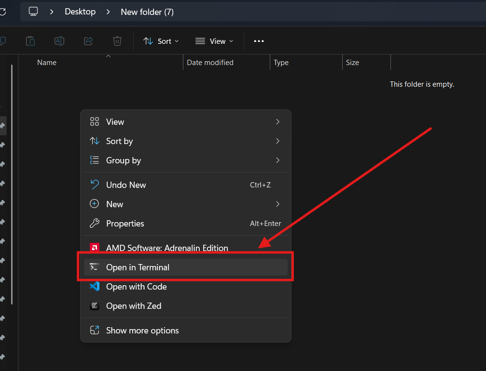

# Nota de Mariano
Aqui les dejo una guía paso a paso para configurar su entorno de desarrollo:

## Paso 1: Configurar tus herramientas
Sigue los tutoriales que estan debajo para poder configurar git y tu cuenta de github correctamente
- [Explicacion Rapida](https://www.youtube.com/shorts/HqWLcGpW7K0)
- [Tutorial Corto 15 mins](https://www.youtube.com/watch?v=vlCXdvcgiE0)
- [Tutorial Completo 1 hora](https://www.youtube.com/watch?v=VdGzPZ31ts8)
    
    Secciones importantes:
    - [Instalar Git](https://youtu.be/VdGzPZ31ts8?t=355&si=aviDsfnp54oqw3ik)
    - [Configurar Git](https://youtu.be/VdGzPZ31ts8?t=502&si=IY1On3jmYee2SQ7d)
    - [Crear una cuenta en github y conectarla](https://youtu.be/VdGzPZ31ts8?t=3639&si=YeiHp0q4UqEcXfpP)

## Paso 2: Clonar el repositorio

- Crea una nueva carpeta en tu computadora para este proyecto
- Abre una terminal de PowerShell y situate en la carpeta que acabas de crear
Puedes navegar hasta la carpeta usando el comando cd <ruta-a-la-carpeta> o presionar click derecho en la carpeta de esta forma:

- Usa git en la terminal que abriste para clonar el repositorio:
```sh
git clone https://github.com/xoloxolo/calculadora.git
```

## Paso 3: Instalar las dependencias (Librerías)

- Ejecuta el siguiente comando en la terminal
```sh
pip install -r requirements.txt
```
